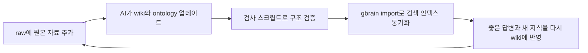

# LLM Wiki Ontology Starter 기술 사용 설명서

이 문서는 `wiki-llm` 패키지를 처음 받은 사용자가 시스템의 목적, 설치 방법, 폴더 구조, 운영 절차, 온톨로지 검증, 바이브 코딩 연결, 배포 방법을 한 번에 이해하도록 만든 기술 사용 설명서입니다.

개발자가 아니어도 따라올 수 있게 쉬운 말로 설명하되, 다른 사람이 운영을 이어받을 수 있을 만큼 파일 위치와 검증 명령을 구체적으로 적습니다.

## 1. 이 시스템은 무엇인가

`LLM Wiki Ontology Starter`는 자료를 AI에게 계속 먹이고, 그 결과를 위키와 온톨로지로 누적하는 개인 지식 시스템입니다.

일반적인 RAG는 질문할 때마다 원문 조각을 검색해서 답합니다. 이 시스템은 한 단계 더 나아가 원문을 읽은 뒤 다음 산출물을 계속 업데이트합니다.

- `wiki/`: 사람이 읽을 수 있는 지식 페이지
- `ontology/tbox.json`: 이 도메인에 어떤 개념과 관계가 있는지 정의한 설계도
- `ontology/abox.json`: 실제 자료에서 발견된 사례, 사람, 도구, 주장, 사실
- `ontology/inference-rules.json`: 이미 아는 사실로부터 새 사실을 추론하는 규칙
- `log.md`: 어떤 자료를 언제 어떻게 반영했는지 남기는 운영 기록

즉, 이 시스템은 "자료 검색기"가 아니라 "계속 성장하는 지식 구조"입니다.

## 2. 누가 쓰면 좋은가

이 시스템은 다음 사용자에게 적합합니다.

- 유튜브, 글, PDF, 회의록, 메모가 흩어져 있어 정리가 어려운 사람
- AI에게 질문할 때마다 같은 설명을 반복하는 사람
- 바이브 코딩을 하면서 프로젝트 맥락을 잃지 않고 싶은 사람
- 개인 공부, 콘텐츠 제작, 업무 리서치, 제품 기획을 지식 베이스로 쌓고 싶은 사람
- 단순 검색이 아니라 개념 간 관계와 추론까지 다루고 싶은 사람

## 3. 필요한 준비물

필수 준비물은 많지 않습니다.

- 압축을 풀 수 있는 PC
- Markdown 파일을 볼 수 있는 편집기
- Obsidian, VS Code, Cursor, Codex, Claude Code 중 하나 이상
- Python 3.10 이상

권장 도구는 다음과 같습니다.

- Obsidian: `wiki/` 페이지를 읽고 연결 관계를 보기 좋습니다.
- Codex 또는 Claude Code: `raw/` 자료를 읽고 위키와 온톨로지를 업데이트하는 에이전트로 씁니다.
- Git: 여러 사람이 함께 관리하거나 버전을 남길 때 좋습니다.
- Bun + gbrain (권장): 위키 페이지를 빠르게 검색하는 로컬 검색 엔진입니다. 설치 후에는 AI가 자동으로 사용합니다.

## 4. 설치 방법

### 4.1 ZIP으로 받는 방법

비개발자는 ZIP 방식이 가장 쉽습니다.

1. GitHub 저장소에서 `Code` 버튼을 누릅니다.
2. `Download ZIP`을 누릅니다.
3. 압축을 풉니다.
4. 압축을 푼 폴더를 열어 `START_HERE.ko.md`를 먼저 읽습니다.
5. `templates/llm-wiki` 폴더를 복사합니다.
6. 복사한 폴더 이름을 내 목적에 맞게 바꿉니다.

예시:

```text
templates/llm-wiki -> my-life-wiki
templates/llm-wiki -> sales-research-wiki
templates/llm-wiki -> ai-study-wiki
```

주의할 점이 있습니다. `templates/llm-wiki`만 따로 멀리 옮기면 `scripts/` 검사 도구와 분리될 수 있습니다. 초보자는 처음에는 패키지 폴더 안에서 그대로 복사해서 쓰는 편이 안전합니다.

### 4.2 Git으로 받는 방법

개발자는 Git으로 받아도 됩니다.

```text
git clone <repo-url>
cd wiki-llm
```

이후 `templates/llm-wiki`를 복사해서 자신만의 vault로 사용합니다.

## 5. 폴더 구조 이해하기

처음 보면 파일이 많아 보일 수 있지만, 실제 운영에서 자주 보는 곳은 몇 개뿐입니다.

```text
wiki-llm/
  START_HERE.ko.md
  CLAUDE.md
  docs/
  scripts/
  templates/
    llm-wiki/
      CLAUDE.md
      raw/
      wiki/
      schema/
      ontology/
      log.md
```

각 폴더의 역할은 다음과 같습니다.

| 위치 | 역할 | 사용자가 하는 일 |
| --- | --- | --- |
| `START_HERE.ko.md` | 전체 시작 안내 | 가장 먼저 읽습니다. |
| `docs/` | 상세 설명서 | 운영, 배포, 온톨로지, 바이브 코딩 전략을 확인합니다. |
| `scripts/` | 검사 및 패키징 도구 | 위키와 온톨로지가 깨지지 않았는지 검사합니다. |
| `templates/llm-wiki/raw/` | 원본 자료 | 유튜브 자막, 회의록, 글, 메모를 넣습니다. |
| `templates/llm-wiki/wiki/` | 정리된 지식 페이지 | 사람이 읽고 검토합니다. |
| `templates/llm-wiki/schema/` | AI 정리 규칙 | AI가 자료를 어떤 형식으로 정리할지 안내합니다. |
| `templates/llm-wiki/ontology/` | 온톨로지 데이터 | 개념, 관계, 실제 사례, 추론 규칙을 저장합니다. |
| `templates/llm-wiki/log.md` | 운영 기록 | 어떤 자료를 반영했는지 기록합니다. |

## 6. 10분 안에 첫 실행하기

아래 순서대로 하면 첫 운영을 시작할 수 있습니다.

1. `templates/llm-wiki`를 복사해서 새 폴더를 만듭니다.
2. Obsidian에서 그 폴더를 vault로 엽니다.
3. `raw/` 폴더에 첫 자료를 넣습니다.
4. (권장, 최초 1회) gbrain 검색 레이어를 설치합니다.

```text
bun install -g github:garrytan/gbrain
gbrain init --pglite
claude mcp add gbrain -- gbrain serve
gbrain import templates/llm-wiki/wiki/
```

5. AI 에이전트에게 `templates/llm-wiki/CLAUDE.md` 규칙을 읽게 합니다.
6. `wiki-ingest` 흐름으로 자료를 정리하게 합니다.
7. `ontology-check` 또는 검사 스크립트로 오류를 확인합니다.
8. 결과가 괜찮으면 다음 자료를 추가합니다. gbrain 동기화는 자동으로 이루어집니다.

AI에게 이렇게 말하면 됩니다.

```text
templates/llm-wiki/CLAUDE.md 규칙을 읽고 raw/ 안의 새 자료를 ingest 해줘.
wiki/ 페이지, ontology/abox.json, log.md를 업데이트해줘.
마지막에는 scripts/ontology_reasoner.py와 scripts/lint_wiki.py를 실행해서 검증 결과를 알려줘.
검사가 통과하면 gbrain import wiki/ 로 검색 인덱스도 업데이트해줘.
```

## 7. 기본 운영 흐름

이 시스템은 네 단계로 운영합니다.



운영할 때 가장 중요한 원칙은 "답변만 받고 끝내지 않는 것"입니다. 좋은 답변, 새로 발견한 관계, 자주 쓰는 판단 기준은 다시 `wiki/`와 `ontology/`에 넣어야 시스템이 성장합니다.

## 8. 운영 스킬 사용법

이 패키지에는 사용자가 명령처럼 부를 수 있는 스킬 표면이 포함되어 있습니다. Codex 또는 에이전트 환경에서 아래처럼 말하면 됩니다.

### 8.1 자료 넣기

```text
wiki-ingest로 raw 자료를 넣어줘.
```

이 스킬은 원본 자료를 읽고 다음 결과를 업데이트하는 흐름입니다.

- `wiki/` 지식 페이지
- `ontology/abox.json` 실제 사례
- `log.md` 작업 기록
- 필요한 경우 `ontology/tbox.json` 후보 변경 제안
- (자동) gbrain 검색 인덱스 동기화 — 검사 통과 후 자동으로 실행됩니다.

### 8.2 질문하기

```text
wiki-query로 내 위키 기준에서 질문에 답해줘.
```

이 스킬은 원문 전체를 다시 무작정 검색하기보다, 이미 정리된 `wiki/`와 `ontology/`를 우선 기준으로 답하게 만듭니다.

gbrain이 설치되어 있으면 먼저 관련 페이지 위치를 빠르게 찾아준 뒤, AI가 그 페이지만 읽고 답합니다. 위키가 커질수록 질문 속도가 빨라집니다.

### 8.3 건강검진하기

```text
wiki-lint로 위키 건강검진을 해줘.
```

확인하는 항목은 다음과 같습니다.

- 끊어진 링크가 있는지
- 출처 표시가 부족한지
- 빈 페이지나 너무 얕은 페이지가 있는지
- 운영 기록이 남아 있는지

### 8.4 온톨로지 검사하기

```text
ontology-check로 T-Box/A-Box와 domain/range 오류를 검사해줘.
```

확인하는 항목은 다음과 같습니다.

- T-Box와 A-Box가 분리되어 있는지
- 관계마다 `domain`과 `range`가 있는지
- 실제 관계가 정의된 개념 범위를 어기지 않는지
- 추론 규칙으로 새 사실을 만들 수 있는지

### 8.5 하루 작업 시작하기

```text
vibe-wiki-session으로 오늘 작업을 시작해줘.
```

바이브 코딩을 시작하기 전, 오늘의 맥락과 관련 지식을 먼저 불러오는 흐름입니다. 목적은 "AI에게 바로 코딩을 시키기 전에, 내 위키를 보고 현재 프로젝트 맥락을 맞추는 것"입니다.

### 8.6 배포 패키지 만들기

```text
wiki-release로 배포 ZIP을 만들고 검증해줘.
```

이 스킬은 `scripts/package_release.ps1`를 사용해 배포용 ZIP을 만들고, 패키지 안에서도 검사 스크립트가 통과하는지 확인하는 흐름입니다.

## 9. 온톨로지 쉽게 이해하기

온톨로지는 어렵게 말하면 "개념과 관계의 체계"입니다. 쉽게 말하면 "이 지식 세계에서 어떤 종류의 것이 있고, 서로 어떤 관계를 맺을 수 있는지 정한 규칙"입니다.

예를 들어 AI 업무 자동화 도메인이라면 다음 개념이 있을 수 있습니다.

- `Source`: 원본 자료
- `Claim`: 자료에서 나온 주장
- `Workflow`: 반복 가능한 작업 흐름
- `Tool`: 사용하는 도구
- `Outcome`: 기대 결과

그리고 다음 관계가 있을 수 있습니다.

- `supports`: 어떤 자료가 어떤 주장을 뒷받침한다.
- `usesTool`: 어떤 워크플로가 어떤 도구를 사용한다.
- `producesOutcome`: 어떤 워크플로가 어떤 결과를 만든다.

이때 중요한 것은 관계마다 가능한 시작점과 끝점이 정해져야 한다는 점입니다.

예시:

```json
{
  "id": "usesTool",
  "domain": "Workflow",
  "range": "Tool"
}
```

이 뜻은 `Workflow`는 `Tool`을 사용할 수 있지만, `Claim`이 `Tool`을 사용한다고 쓰면 구조상 이상하다는 뜻입니다.

## 10. T-Box와 A-Box

이 시스템은 온톨로지를 두 층으로 나눕니다.

### 10.1 T-Box

T-Box는 설계도입니다. 어떤 개념과 관계가 가능한지 정의합니다.

파일 위치:

```text
templates/llm-wiki/ontology/tbox.json
```

예시:

```json
{
  "classes": [
    { "id": "Workflow", "label": "작업 흐름" },
    { "id": "Tool", "label": "도구" }
  ],
  "relations": [
    { "id": "usesTool", "domain": "Workflow", "range": "Tool" }
  ]
}
```

### 10.2 A-Box

A-Box는 실제 사례입니다. 원본 자료에서 발견한 구체적인 사람, 자료, 주장, 도구, 워크플로가 들어갑니다.

파일 위치:

```text
templates/llm-wiki/ontology/abox.json
```

예시:

```json
{
  "instances": [
    { "id": "workflow.daily-vibe-session", "class": "Workflow" },
    { "id": "tool.codex", "class": "Tool" }
  ],
  "facts": [
    {
      "subject": "workflow.daily-vibe-session",
      "predicate": "usesTool",
      "object": "tool.codex"
    }
  ]
}
```

## 11. Reasoner와 추론 예시

Reasoner는 온톨로지의 구조가 맞는지 검사하고, 이미 있는 사실로부터 새 사실을 추론합니다.

검사 명령:

```text
python scripts/ontology_reasoner.py --root templates/llm-wiki
```

기대 출력 예시:

```text
Ontology check OK
- classes: 10
- relations: 8
- instances: 7
- facts: 5
- inferred facts: 2
```

추론은 이런 방식으로 이해하면 됩니다.

이미 아는 사실:

```text
워크플로 A는 도구 B를 사용한다.
도구 B는 기능 C를 가능하게 한다.
```

추론 가능한 사실:

```text
워크플로 A는 기능 C에 의존한다.
```

이런 추론이 가능해지면 사용자는 단순히 "자료에 뭐라고 쓰여 있지?"를 넘어서 "내 시스템 안에서 이 도구를 바꾸면 어떤 워크플로가 영향을 받지?" 같은 질문을 할 수 있습니다.

## 12. 위키 검사하기

위키 구조 검사는 다음 명령으로 실행합니다.

```text
python scripts/lint_wiki.py --root templates/llm-wiki
```

기대 출력 예시:

```text
Wiki lint OK
- wiki pages: 5
- wikilinks: 17
- source signals: 4
```

이 검사는 온톨로지 추론보다 사람 문서 쪽에 가깝습니다. 링크, 출처, 페이지 구조가 너무 약하지 않은지 확인합니다.

## 13. 바이브 코딩과 연결하는 법

바이브 코딩은 AI에게 자연어로 작업을 시키며 빠르게 구현하는 방식입니다. 하지만 자료와 결정이 흩어지면 며칠 뒤 맥락을 잃기 쉽습니다.

이 시스템은 바이브 코딩의 기억 장치 역할을 합니다.

권장 루프는 다음과 같습니다.

1. 작업 전: `wiki-query`로 기존 결정과 관련 자료를 확인합니다.
2. 작업 중: Codex, Claude Code, Cursor로 구현합니다.
3. 작업 후: 구현 결과, 새로 배운 점, 결정 이유를 `wiki-ingest`로 다시 저장합니다.
4. 검증: `wiki-lint`와 `ontology-check`로 구조가 깨지지 않았는지 확인합니다.

초보자는 하루에 아래 세 문장만 반복해도 됩니다.

```text
vibe-wiki-session으로 오늘 작업 맥락을 잡아줘.
```

```text
이 작업에서 새로 생긴 결정과 배운 점을 wiki-ingest로 정리해줘.
```

```text
wiki-lint와 ontology-check로 오늘 지식베이스 상태를 검사해줘.
```

gbrain이 설치되어 있으면 위 세 단계에서 검색과 동기화가 자동으로 포함됩니다. 따로 명령하지 않아도 됩니다.

## 14. 배포 ZIP 만들기

배포용 ZIP은 다음 명령으로 만듭니다.

```text
powershell -ExecutionPolicy Bypass -File scripts/package_release.ps1
```

생성 위치:

```text
dist/wiki-llm-starter.zip
```

ZIP에 포함되는 핵심 항목은 다음과 같습니다.

- `START_HERE.ko.md`
- `CLAUDE.md`
- `docs/`
- `scripts/`
- `templates/llm-wiki/`
- `.agents/skills/`
- `.codex/skills/`

배포 전에 최소한 아래 명령이 통과해야 합니다.

```text
python scripts/ontology_reasoner.py --root templates/llm-wiki
python scripts/lint_wiki.py --root templates/llm-wiki
```

## 15. 다른 사람에게 전달할 때 설명 문구

패키지를 전달할 때는 아래처럼 설명하면 됩니다.

```text
이 ZIP은 AI와 함께 쓰는 개인 지식 시스템 템플릿입니다.
START_HERE.ko.md를 먼저 읽고, templates/llm-wiki 폴더를 복사해서 자기 주제 이름으로 바꾼 뒤 raw/에 자료를 넣으면 됩니다.
AI에게 wiki-ingest, wiki-query, wiki-lint, ontology-check 같은 명령으로 운영시키면 위키와 온톨로지가 함께 성장합니다.
```

## 16. 운영 중 자주 생기는 문제

### 16.1 Python 명령이 안 됩니다

증상:

```text
python is not recognized
```

해결:

- Python이 설치되어 있는지 확인합니다.
- Windows에서는 `py` 명령을 써볼 수 있습니다.
- 설치된 Python 경로가 있다면 전체 경로로 실행합니다.

예시:

```text
py scripts/ontology_reasoner.py --root templates/llm-wiki
```

### 16.2 온톨로지 검사에서 domain/range 오류가 납니다

뜻:

어떤 관계가 설계도에서 허용한 개념 범위를 벗어났다는 의미입니다.

해결:

1. 오류에 나온 `predicate`를 `ontology/tbox.json`에서 찾습니다.
2. 그 관계의 `domain`과 `range`를 확인합니다.
3. `ontology/abox.json`의 subject와 object class가 맞는지 확인합니다.
4. 실제 자료가 맞다면 T-Box를 확장하고, 잘못 분류했다면 A-Box를 고칩니다.

### 16.3 위키 페이지는 생겼는데 출처가 부족합니다

해결:

AI에게 이렇게 말합니다.

```text
wiki/ 페이지마다 어떤 raw 자료에서 온 내용인지 출처 표시를 보강해줘.
추정과 사실을 구분하고, 확실하지 않은 내용은 uncertainty로 표시해줘.
```

### 16.4 AI가 너무 많은 구조를 추가합니다

해결:

처음에는 T-Box를 작게 유지합니다. 새 class나 relation은 다음 조건을 만족할 때만 추가합니다.

- 같은 종류의 사례가 3개 이상 반복된다.
- 기존 개념으로는 의미가 계속 흐려진다.
- 질문이나 추론 품질이 실제로 좋아진다.

### 16.5 ZIP으로 받은 사용자가 어디서 시작할지 모릅니다

해결:

`START_HERE.ko.md`와 이 문서 `docs/user-manual.ko.md`를 먼저 보게 합니다. 기술적인 운영자는 `docs/deployment.ko.md`와 `docs/ontology-guide.ko.md`까지 보면 됩니다.

## 17. 운영 품질 기준

이 시스템이 잘 운영되고 있는지 판단하는 기준은 다음과 같습니다.

- 새 자료가 들어오면 `raw/`, `wiki/`, `ontology/`, `log.md`가 함께 업데이트된다.
- 질문 답변이 원문 검색에만 의존하지 않고 기존 위키와 온톨로지를 참조한다.
- T-Box와 A-Box가 섞이지 않는다.
- 관계마다 `domain`과 `range`가 있다.
- Reasoner 검사를 통과한다.
- 추론 결과를 사람이 이해할 수 있는 말로 설명할 수 있다.
- 초보자가 같은 명령을 반복해도 운영이 무너지지 않는다.
- ZIP으로 받아도 필요한 문서, 템플릿, 검사 스크립트, 스킬이 함께 들어 있다.

## 18. 더 읽을 문서

- 시작 안내: `START_HERE.ko.md`
- LLM Wiki 설계 규칙: `docs/llm-wiki-rules.ko.md`
- 온톨로지 설명: `docs/ontology-guide.ko.md`
- 생활 적용 가이드: `docs/life-application-guide.ko.md`
- 바이브 코딩 운영 전략: `docs/vibe-coding-operation-strategy.ko.md`
- 스킬 라우팅: `docs/skill-routing.ko.md`
- 배포 가이드: `docs/deployment.ko.md`
- 수용 기준: `docs/acceptance-checklist.ko.md`

## 19. 한 줄 요약

이 시스템은 자료를 넣을수록 `wiki/`는 사람이 읽는 지식으로, `ontology/`는 AI가 이해하고 검증하는 구조로 성장하게 만드는 LLM 기반 지식 운영 템플릿입니다.
